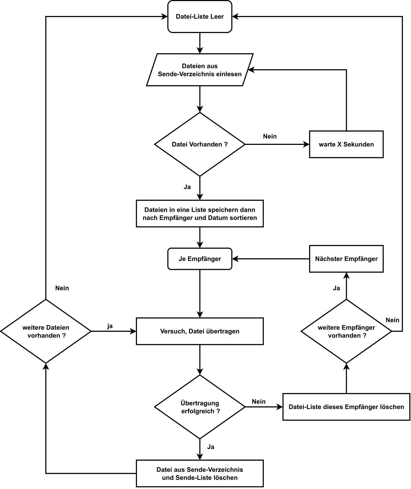
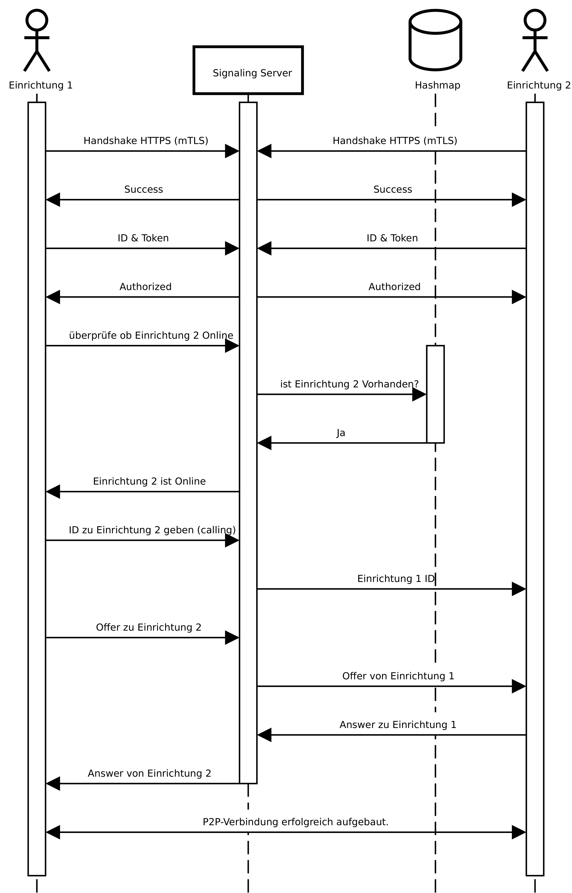

# Dateiübertragung mit WebRTC

Dies ist ein Node.js-Programm, das den Peer-to-Peer-Transfer von (medizinischen) Dateien zwischen zwei Benutzern mittels WebRTC-Technologie ermöglicht. Dieses Projekt wurde im Rahmen einer Bachelorarbeit bei der Firma mediIT GmbH erstellt.

## Voraussetzungen

- Node.js v14 oder höher
- NPM v7 oder höher

## Installation

### Server

1. Navigieren Sie zum Projektordner: `cd Server`
2. Installieren Sie die Abhängigkeiten: `npm install`

### Client

1. Navigieren Sie zum Projektordner: `cd Client`
2. Installieren Sie die Abhängigkeiten: `npm install`

## Verwendung des Servers

* Erstellung der self-signed Certificate mit Client-Side Certificate
* Starten Sie den Server: `npm start`

## Verwendung des Clients

* Zuerst sollte ein Ordner mit diesem Pfad erstellt werden: `C:\Common\termininfo\InstitutionInterface\fileexchange\`
* Dieser Ordner sollte eine Datei namens `ID.txt` enthalten, die eine ID enthält und die Ordner `receiveData` und `sendData` sollten erstellt werden
* Erstellung der self-signed Certificate mit Client-Side Certificate
* Erstellung der config.ini 
* Starten Sie einen Client: `npm start`.

## So funktioniert es

## Lizenz

Dieses Projekt ist lizenziert unter der [GNU GENERAL PUBLIC LICENSE](LICENSE).
